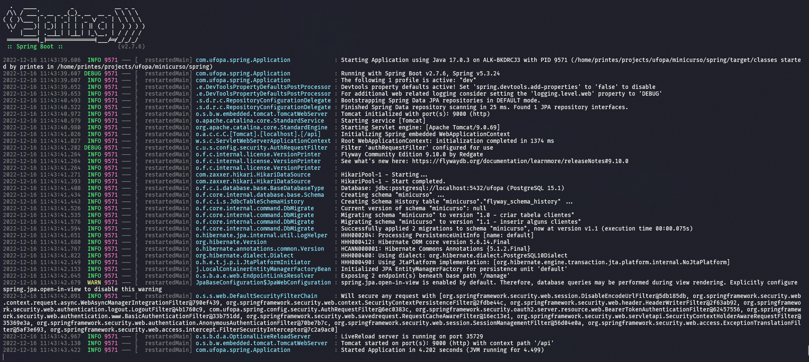

# Projeto REST API de Springboot
[]()

## 📝 Sumário

- [Sobre](#about)
- [Começando](#started)
- [Desenvolvimento](#development)
- [Agradecimento](#thanks)

## 🧐 Sobre <a name = "about"></a>

Projeto REST API, utilizado para o minicurso de Springboot, pertencente à programação de Projeto de Carreiras TI da Universidade Federal do Oeste do Pará - UFOPA, campus de Oriximiná.

## 🚀 Começando <a name = "started"></a>

Projeto é desenvolvido com Maven, Java 11 e Spring Boot 2.7.5. Veja em [Desenvolvimento](#development) para mais detalhes sobre os recursos abordados.
Abaixo, segue os passos para execução do projeto. Se houver erros ou estiver com dúvidas, você poderá contactar-me para ajuda-lo. 

### Pré-requisitos

É necessário instalar a JDK 11 e o PostgreSQL na máquina local, mas indico o uso de _containers_, como o [Docker](https://www.docker.com/) com este projeto.

A aplicação faz uso de algumas variáveis de ambiente, então, na raiz do projeto, crie o arquivo ```dev.env``` e cole o texto abaixo, substituindo os **ASTERISCOS**, pelos valores que você desejar:
```
#Nome do usuário do banco de dados
API_USER=**********

#Senha do usuário do banco de dados
API_PASS=**********

#Nome do banco de dados aplicação 
API_DATABASE=**********

#Nome do esquema da aplicação
API_SCHEMA=**********

#Caminho absoluto do diretório do seu usuário de sistema
API_LOCAL=$HOME
```
E também de um par de chaves _RSA_, para isso, no terminal, navegue para ```/src/main/rescurces/certs``` e execute os seguintes comandos **OpenSSL**, para criação do par, extração de chave pública e de chave privada, respectivamente: 
```
openssl genrsa -out keypair.pem 2048

openssl rsa -in keypair.pem -pubout -out public.pem

openssl pkcs8 -topk8 -inform PEM -outform PEM -nocrypt -in keypair.pem -out private.pem
```

Para finalizar, vamos criar dois _containers_, um para o banco de dados e outro para o servidor da aplicação. Este último irá conter todas as configurações necessárias para o ambiente de desenvolvimento da Api. Abra o terminal, certifique-se que, está na raiz do diretório do projeto e execute o único comando abaixo:
```
docker-compose -p minicurso -f docker/dev.docker-compose.yml --env-file dev.env --profile api up --build
```
Se ocorrer erros, execute o próximo comando, corrija e tente o anterior novamente:
```
docker-compose -p minicurso -f docker/dev.docker-compose.yml --env-file dev.env down --volumes
```

> **_Nota:_**  Caso ocorra o erro, que o script **mvnw** não foi encontrado, execute o comando ```dos2unix mvnw``` e tente novamente.

### Execução

Se você executou com sucesso o comando anterior, o servidor já está rodando dentro do container da aplicação, com restart automático quando houver mudanças e com suporte para _Debug_. Durante o desenvolvimento, se ocorrer erros internos, o container da aplicação poderá parar, somente bastando executa-lo novamente para refletir os novos ajustes.

Mas, se estiver com o ambiente local configurado com os pré-requisitos da seção anterior, crie somente o container de banco de dados com o comando:
```
docker-compose -p minicurso -f docker/dev.docker-compose.yml --env-file dev.env up -d
```
em seguida execute no terminal o comando maven abaixo, substituindo ```${API_DATABASE}``` pelo valor da variável no arquivo ```dev.env```:
```
./mvnw spring-boot:run -Dspring-boot.run.profiles=dev -Dspring-boot.run.arguments=--spring.datasource.url=jdbc:postgresql://localhost:5432/${API_DATABASE}
```
Através do maven também, você tem a opção de gerar o executável _JAR_, simplesmente aplicando o comando:
```
./mvnw clean package
```
E para executar, faça:
```
java -jar target/spring-0.0.1-SNAPSHOT.jar --spring.profiles.active=dev --spring.datasource.url=jdbc:postgresql://localhost:5432/${API_DATABASE}
```
Esta última opção, tem o intuito de gerar o executável **final** de uma versão do projeto, visto que todo o código e dependências estão compiladas e embutidas, não refletindo novos ajustes.  

Em todos os cenários, você deverá ser capaz de gerar a seguinte saída da aplicação:



## 🔧 Desenvolvimento <a name = "development"></a>

Os seguintes conceitos, recursos e tecnologias são aplicados no projeto:

- API REST;
- JPA com PostgreSQL;
- CRUD completo de uma entidade mapeada no banco;
- Mapeamentos ente Objetos de transferência de dados (DTOs) e entidades com MapStruct;
- Pesquisas com Specifications;
- Validações da entrada de dados;
- Tratamento de exceções;
- Autenticação e autorização com JWT;
- Testes unitários e de integração com Testcontainers e cobertura de testes;
- Documentação com Swagger;
- Monitoramento com Actuator;
- Conteinerização da aplicação para desenvolvimento;

## 🎉 Agradecimento <a name = "thanks"></a>
Agradeço ao convite da docente Flávia Monteiro para ministrar e incentivar o compartilhamento do conhecimento entre todos os envolvidos.